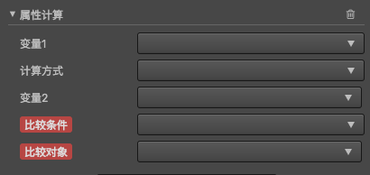
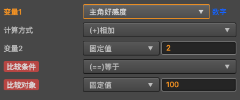

# 剧情跳转
提供剧情跳转的功能

 

## 面板组件
### 剧情选项分支

### 属性计算 

属性计算变量来源于[属性管理面板](../property-mgr.md),在属性管理面板中添加自己想要添加的变量,即可在该组件中进行操作   

#### 参与运算的参数
- 变量1: 计算表达式的左值
- 计算方式: 计算表达式的计算方式
- 变量2: 计算表达式的右值

详细的计算过程为: 变量1 = (变量1) (计算方式) (变量2)

#### 参与比较的参数
- 变量1: 比较的左值
- 比较条件: 比较的方式
- 比较对象: 比较的右值

详细的比较过程为: 结果 = (变量1) (比较方式) (比较对象)

特别需要注意的是, 比较的结果必将是一个布尔类型的数值,如果条件成立,那么章节将执行跳转操作.

目前支持的计算参数类型为: 
- 数字类型:  
    
在上图中, 我们在属性管理里面增加了一个变量**主角好感度**的数字变量,并设置初始值为0,
那么在运行过程中,调试信息如下:    
  
观察发现计算步骤为:
    - 设置的**变量1**会和**变量2**进行一次计算,产生结果A
    - 将上一步产生的结果A赋值给**变量1**
    - 将**变量1**现在的值和指定的**比较对象**进行一次比较,产生结果B
    - 最终产生的结果B必将是一个布尔值,该值将作为章节跳转与否的判断依据
- 字符串 
    - 同理
- 布尔
    - 同理,唯一需要注意的可能是取反操作

#### 变量计算日志

游戏在浏览器运行过程中,如果选项添加的属性计算组件,那么会在浏览器控制台打印出来变量计算,比较过程,方便及时掌握属性的运算情况.

如何打开浏览器控制台:
- 一般浏览器F11都会进入到开发者模式,在开发者模式中找到 **Console**

- 如果浏览器屏蔽了开发者模式,请自行百度**xx浏览器如何打开开发者模式**,一般情况下,会在浏览器的菜单栏中有相关菜单打开开发者模式

